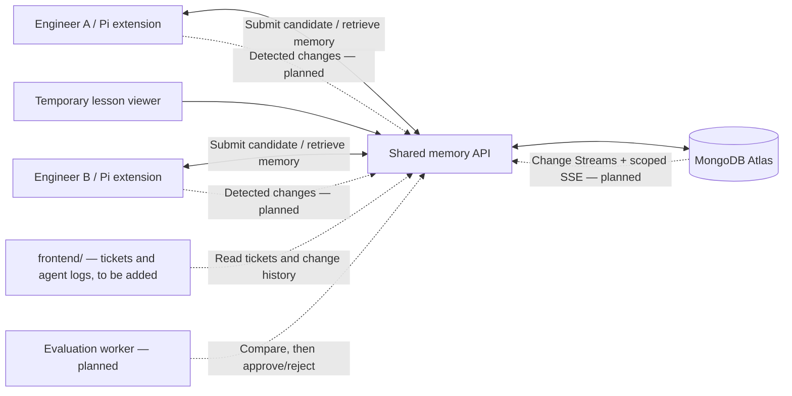

# Team Memory Harness

**One engineer's agent learns a useful lesson. The team's agents can apply it to their own tickets.**

A hackathon starter for shared engineering memory and self-improving ticket triage, built around
**Pi + TypeScript + MongoDB Atlas**. Engineers work in separate Pi sessions and repositories/checkouts.
The team's own frontend will display tickets and a history of changes agents detect. Agents send
observations and proposed changes through the API to MongoDB. The proposed system extracts lessons
from those records, tests changes to the agent's workflow, and distributes validated knowledge
across the team.

The existing ticket/log frontend will be added later at the repository root as `frontend/`.
It is not included yet. `apps/dashboard` remains a temporary lesson/evidence viewer.

Primary track: **Recursive Harnessing**. Persistent cross-session knowledge also supports future
long-horizon work. Sharing memory alone is not the novelty: the intended contribution is a measured
loop from one engineer's failure to an improvement in another engineer's workflow.

## Repository status

This is a **runnable skeleton, not the finished learning system**.

| Capability | Status |
| --- | --- |
| Local API, input validation, scoped lesson listing/candidate submission | Implemented |
| Disposable in-memory storage with labeled sample data | Implemented |
| MongoDB lesson repository and ordinary indexes | Implemented; requires a configured database |
| Temporary React viewer in `apps/dashboard` for lessons and evidence | Implemented |
| Team's ticket/log dashboard in root `frontend/` | To be added later |
| Native ticket and agent-change log API/storage | Shared types + repository interfaces only |
| Pi `/team-memory`, `/share-lesson`, and context injection | Starter implementation |
| Local `.team-memory/MEMORY.md` generated from published lessons | Starter implementation |
| Automatic extraction of lessons from agent failures | Planned |
| Baseline/candidate evaluations and publication gate | Interface + fixtures only |
| Harness configuration rollout, rollback, and audit history | Contract/design only |
| Semantic retrieval / embedding generation / Atlas Vector Search | Adapter interface only |
| Live synchronization through Change Streams and SSE | Design only; refresh is currently per run/manual |
| Per-user authentication, membership, and remote deployment | Planned; current services bind to loopback |

No LLM calls or paid cloud resources are created by `npm run dev`. The single published lesson
in memory mode is synthetic demo data, explicitly marked `origin: demo`. Submitting a lesson
creates a **candidate**; it cannot self-publish. There is no promotion endpoint yet.

## Quick start

Prerequisites: **Node.js 22.19+** and npm. Use the latest Node 22 LTS release if possible.

```bash
nvm install
nvm use
npm install
cp .env.example .env
npm run dev
```

- Temporary lesson viewer: <http://127.0.0.1:5173>
- API health: <http://127.0.0.1:4317/health>
- API: <http://127.0.0.1:4317/v1/lessons>

With `MONGODB_URI` unset, the API uses in-memory demo data. It resets on restart.
Both apps read the root `.env`. The dashboard's development proxy adds the local API token
server-side; it is not included in the browser bundle. The static production dashboard build
does not include this development proxy and needs an authenticated backend deployment.

To persist lesson candidates, configure `MONGODB_URI` and `MONGODB_DATABASE`, then restart the API.
The MongoDB adapter starts empty and creates only ordinary collection indexes. See
[MongoDB setup](infra/mongodb/README.md) for planned collections, vector indexes, and Change Streams.

```bash
npm run dev:api          # API only
npm run dev:dashboard    # Temporary lesson viewer only
npm run evaluate         # Prints evaluator scaffold status; does not score or publish
npm run check            # Tests, TypeScript checks, and dashboard production build
```

## Try the Pi extension

The extension is pinned against `@earendil-works/pi-coding-agent` **0.87.1**.
Run these commands from the repository root after `npm install`:

```bash
TEAM_API_URL=http://127.0.0.1:4317 \
TEAM_API_TOKEN=local-demo-token \
ENGINEER_ID=engineer-a \
./node_modules/.bin/pi --extension ./packages/pi-extension/src/index.ts
```

Pi handles model/provider configuration and credentials separately. This extension reads its
configuration from the process environment; Pi does not automatically load this repository's `.env`.
If you changed the API token, pass the matching value to Pi.

Inside Pi:

```text
/team-memory
/share-lesson Check repeated events | Inspect event ID deduplication before classifying duplicate effects | DEMO-101
```

The first command refreshes `.team-memory/MEMORY.md` under Pi's current working directory. The second
submits a candidate and leaves it unpublished. The extension also fetches memory before each new
agent run and supplies a current snapshot to the model, removing older injected snapshots from
the outgoing context. It does not change the model's weights or automatically execute lesson text.

For two independent agents, start Pi in separate checkouts, use different `ENGINEER_ID` values,
and load this extension by its absolute path. Both use the same API and scope. Separate checkout
files and conversations remain local; shared memory is a generated view of backend records.
The current local-only server is for a single-machine two-session demo. Actual remote engineers
need a reachable authenticated HTTPS API with team membership checks.

## Frontend integration plan

When the existing UI is added as root `frontend/`, it will own the ticket list, ticket detail,
agent change timeline, and visibility into shared lessons. Add its package/scripts to the workspace
when it arrives; current commands still run `apps/dashboard` and do not assume its framework.

The planned data flow is:

1. An engineer views a ticket in the frontend and works on it with Pi.
2. The agent detects a change, correction, test result, or potential lesson.
3. Pi submits a structured event to the API; the API stores it in MongoDB linked to the ticket,
   agent/session, engineer, and project.
4. The frontend reads the ticket and its change history through the API.
5. Reusable lessons follow the existing candidate → evaluation → publication → shared-memory flow.

The initial shared `Ticket`, `AgentChangeInput`, and `AgentChange` types live in
`packages/contracts/src/index.ts`. Proposed routes and payloads are documented in
[the frontend integration contract](docs/frontend-integration.md). These are design contracts;
the ticket and agent-log routes, automatic event capture, and their MongoDB repositories are not
implemented yet. An observed/proposed change in the log is not necessarily an applied change.

## Architecture sketch


The editable Mermaid diagram and design details are in [docs/architecture.md](docs/architecture.md).
Solid boxes in the sketch represent runnable starters; dashed boxes represent planned components.



## Structure

```text
apps/
  api/                   Fastify API, MongoDB lessons, ticket/change-log contracts
  dashboard/             Temporary React + Vite lesson/evidence viewer
  evaluator/             Evaluation worker interface; intentionally does not publish
packages/
  contracts/             Memory schemas, ticket/change-log types, synthetic demo data
  pi-extension/          Pi commands, API client, generated memory file, context hook
docs/
  architecture.md        Editable diagram, data flow, boundaries, implementation stages
  architecture.svg       Architecture sketch for preview/export
  frontend-integration.md Planned ticket/log API and frontend handoff
  demo.md                Local demo and intended two-engineer learning demonstration
evals/
  triage-suite.json       Synthetic positive and negative-control cases
examples/
  lesson-candidate.json  Example candidate request
infra/
  mongodb/               Database, vector retrieval, and synchronization notes
```

Root `frontend/` is the planned destination for the team's existing UI and has not been created.

## API surface

All `/v1` endpoints require `Authorization: Bearer <TEAM_API_TOKEN>`. One configured token maps
to one configured team/project in this local starter. `authorId` is a self-reported demo label,
not an authenticated identity. The API assigns scope and initial candidate status itself.

| Method | Route | Behavior |
| --- | --- | --- |
| GET | `/health` | Health, storage mode, and skeleton stage |
| GET | `/v1/lessons` | Up to 100 recent scoped lessons, including candidates |
| GET | `/v1/memory` | Up to 10 recent published scoped lessons; no semantic ranking yet |
| POST | `/v1/lessons` | Validate and persist a candidate; cannot publish |

```bash
curl http://127.0.0.1:4317/v1/memory \
  -H 'Authorization: Bearer local-demo-token'

curl http://127.0.0.1:4317/v1/lessons \
  -H 'Authorization: Bearer local-demo-token' \
  -H 'Content-Type: application/json' \
  --data-binary @examples/lesson-candidate.json
```

## The intended learning loop

1. Engineer A views a ticket in the team's frontend and investigates it with Pi.
2. Pi reports detected changes and feedback to the API; MongoDB stores the ticket-linked log
   for display in the frontend.
3. Extract a lesson with evidence, applicability, and a proposed workflow change.
4. Run the current and proposed workflows against a fixed suite of separate tickets.
5. Record actual scores and regressions. Publish an immutable version only when the gate passes.
6. Notify other engineers' agents, which refresh relevant memory at a safe model-call boundary.
7. Engineer B's agent applies the lesson to a different ticket and records the outcome.

MongoDB is authoritative. Markdown files are derived local caches, not concurrently edited shared
documents. Lessons are scoped and versioned individually; private conversations, credentials, and
unfinished patches are not automatically uploaded. A ticket reference is a provenance claim, not
proof that a lesson passed evaluation.

## Suggested implementation order

1. Add the existing UI under `frontend/`; connect it to ticket and agent-change APIs backed by MongoDB.
2. Capture ticket-linked observations from Pi tool results and engineer corrections.
3. Implement a fixed evaluator and evidence-backed promotion, including a negative control.
4. Add Atlas Vector Search and context budgets with component/version applicability checks.
5. Add versioned harness updates, rollback, consumption logs, and Change Stream/SSE notifications.
6. Add per-user auth and connect two engineers on separate machines.

Keep an end-to-end two-ticket demonstration working as each layer is added. See [demo plan](docs/demo.md).

## References

- [Pi](https://pi.dev/) and [extension API](https://github.com/earendil-works/pi/blob/main/packages/coding-agent/docs/extensions.md)
- [MongoDB Change Streams](https://www.mongodb.com/docs/manual/changestreams/)
- [MongoDB Vector Search](https://www.mongodb.com/docs/atlas/atlas-vector-search/vector-search-overview/)
- [Hackathon event](https://cerebralvalley.ai/e/mongodb-nyc-hackathon)

LangChain/LangGraph are optional future integrations. Pi owns the agent loop in this design.
