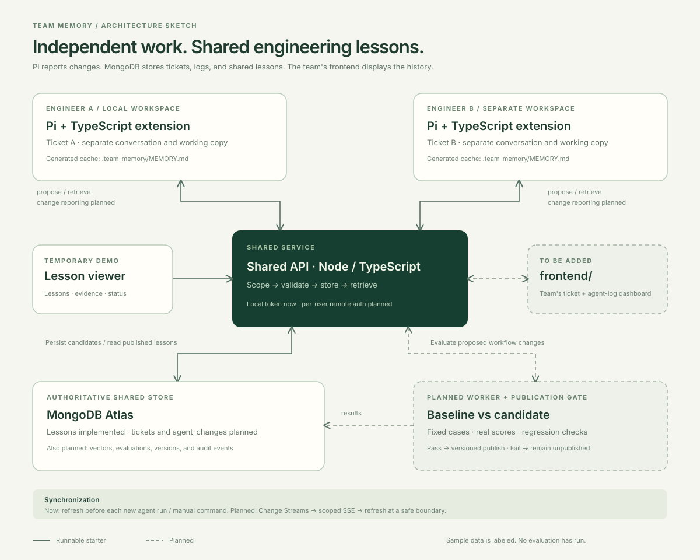
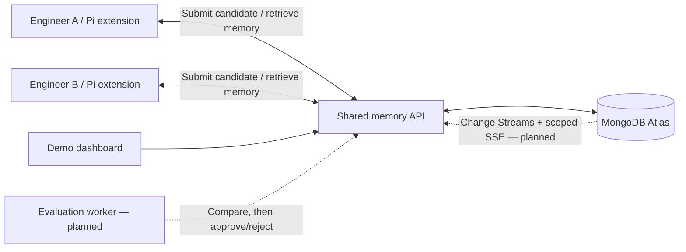

# Team Memory Harness

**One engineer's agent learns a useful lesson. The team's agents can apply it to their own tickets.**

A hackathon starter for shared engineering memory and self-improving ticket triage, built around
**Pi + TypeScript + MongoDB Atlas**. Engineers work in separate Pi sessions and repositories/checkouts.
The proposed system extracts lessons from failures, tests changes to the agent's workflow, and
distributes validated knowledge across the team.

Primary track: **Recursive Harnessing**. Persistent cross-session knowledge also supports future
long-horizon work. Sharing memory alone is not the novelty: the intended contribution is a measured
loop from one engineer's failure to an improvement in another engineer's workflow.

For teammates and agents joining the shared workspace, start with
[team access and onboarding](docs/team-access.md): individual credentials, role
permissions, browser sign-in, agent read/write commands, rotation and revocation.

## Repository status

This is a **runnable skeleton, not the finished learning system**.

| Capability | Status |
| --- | --- |
| Local API, input validation, scoped lesson listing/candidate submission | Implemented |
| Disposable in-memory storage with labeled sample data | Implemented |
| MongoDB lesson repository and ordinary indexes | Implemented; requires a configured database |
| React Catalog for lessons, tickets and reported activity | Implemented; search/filter recent records, inspect evidence and histories |
| Shared Canvas and activity Timeline | Implemented; see [Canvas](docs/shared-canvas.md) and [tracking](docs/memory-tracking.md) |
| Read-only sharing preview | Implemented with synthetic data; remote hosting pending |
| Pi `/team-memory`, `/share-lesson`, and context injection | Starter implementation |
| Local `.team-memory/MEMORY.md` generated from published lessons | Starter implementation |
| Automatic extraction of lessons from agent failures | Planned |
| Baseline/candidate evaluations and publication gate | Fixed-suite scorer with version-checked publish/reject. No model calls |
| Harness configuration rollout, rollback, and audit history | Contract/design only |
| Semantic retrieval / embedding generation / Atlas Vector Search | Adapter interface only |
| Live synchronization through Change Streams and SSE | Design only; refresh is currently per run/manual |
| Individual team grants, roles and browser sessions | Implemented with local security checks; real member enrollment pending |
| Private credential issuance and authenticated access checks | Implemented; run `npm run access:issue -- --help` and follow the onboarding guide |
| Vercel live UI and server API | Deployment configuration implemented; remote deployment and Atlas route unverified |

No LLM calls or paid cloud resources are created by `npm run dev` or `npm run evaluate`. The single published lesson
in memory mode is synthetic demo data, explicitly marked `origin: demo`. Submitting a lesson
creates a **candidate**; it cannot self-publish. `POST /v1/lessons/:id/evaluate` scores that candidate
against `evals/triage-suite.json` and publishes only when the gate passes for the expected version.

## Quick start

Prerequisites: **Node.js 22.19+** and npm. Use the latest Node 22 LTS release if possible.

```bash
nvm install
nvm use
npm install
cp .env.example .env
npm run dev
```

- Dashboard: <http://127.0.0.1:5173>
- API health: <http://127.0.0.1:4317/health>
- API: <http://127.0.0.1:4317/v1/lessons>

With `MONGODB_URI` unset, the API uses in-memory demo data. It resets on restart.
Both apps read the root `.env`. The dashboard's development proxy adds the local API token
server-side; it is not included in the browser bundle. The static production dashboard build
does not include this development proxy and needs an authenticated backend deployment.

To persist lesson candidates and tickets, configure `MONGODB_URI` and `MONGODB_DATABASE`, then restart the API.
The MongoDB adapter starts empty and creates only ordinary collection indexes. See
[MongoDB setup](infra/mongodb/README.md) for planned collections, vector indexes, and Change Streams.
Load the starting data with `npm run seed -- corpus/xchange.json corpus/event-platform.json`; the
[data layer guide](docs/data-layer.md) covers both projects, team writes and agent reads.

```bash
npm run dev:api          # API only
npm run dev:dashboard    # UI only
npm run evaluate         # Prints the fixed suite identity; does not score or publish
npm run check            # Tests, TypeScript checks, and dashboard production build
```

## Use the Catalog

The dashboard opens directly into a table of tickets and lessons. Use **Add ticket** for a short
summary, optional reference, component and description. Tickets are created in the API's current
team/project with status `open`; this does not create a Jira issue or start an agent run.
Open a row to inspect the full record. Lesson details retain the existing fixed-suite evaluation
action, which may publish or reject a candidate.

Search, type/status filters and sort apply to the latest 100 records of each type before table
pagination. Filters and selected records are linkable; column visibility, order, width and text
wrapping are stored in this browser per project. This is a recent-record view, not complete history
search. Temporary storage survives browser refreshes but resets when the API restarts; the UI labels
that mode. Configured MongoDB stores tickets durably. See [Catalog scope](docs/catalog-brief.md) and
[verification](docs/catalog-evidence.md).

## Try the Pi extension

The extension is pinned against `@earendil-works/pi-coding-agent` **0.87.1**.
Run these commands from the repository root after `npm install`:

```bash
TEAM_API_URL=http://127.0.0.1:4317 \
TEAM_API_TOKEN=local-demo-token \
ENGINEER_ID=engineer-a \
./node_modules/.bin/pi --extension ./packages/pi-extension/src/index.ts
```

Pi handles model/provider configuration and credentials separately. This extension reads its
configuration from the process environment; Pi does not automatically load this repository's `.env`.
If you changed the API token, pass the matching value to Pi.

Inside Pi:

```text
/team-memory
/share-lesson Check repeated events | Inspect event ID deduplication before classifying duplicate effects | DEMO-101
```

The first command refreshes `.team-memory/MEMORY.md` under Pi's current working directory. The second
submits a candidate and leaves it unpublished. The extension also fetches memory before each new
agent run and supplies a current snapshot to the model, removing older injected snapshots from
the outgoing context. It does not change the model's weights or automatically execute lesson text.

For two independent agents, start Pi in separate checkouts, use different `ENGINEER_ID` values,
and load this extension by its absolute path. Both use the same API and scope. Separate checkout
files and conversations remain local; shared memory is a generated view of backend records.
The loopback server is for a single-machine demo. The Vercel entry supports individually
issued team credentials and browser sessions; deployment and real teammate enrollment
still require verification. See [live hosting and access](docs/frontend-sharing.md).
Use a separate credential for every teammate and agent installation; follow
[team access](docs/team-access.md) for hosted onboarding and the `access` check.

## Frontend integration

`apps/dashboard` remains the application frontend. Keep its Catalog, Canvas and Timeline; there is no planned migration to a separate root `frontend/` app.
The incoming agent-event types are future integration contracts, not callable endpoints.
See [the reconciled integration contract](docs/frontend-integration.md) before wiring a client.

## Architecture sketch



The editable Mermaid diagram and design details are in [docs/architecture.md](docs/architecture.md).
Solid boxes in the sketch represent runnable starters; dashed boxes represent planned components.



## Structure

```text
apps/
  api/                   Fastify API, memory/MongoDB repositories, integration contracts
  dashboard/             React + Vite Catalog, ticket entry, lesson/evidence inspector
  evaluator/             Evaluation worker interface; intentionally does not publish
packages/
  contracts/             Zod schemas, shared types, memory rendering, synthetic demo data
  pi-extension/          Pi commands, API client, generated memory file, context hook
docs/
  architecture.md        Editable diagram, data flow, boundaries, implementation stages
  architecture.svg       Architecture sketch for preview/export
  demo.md                Local demo and intended two-engineer learning demonstration
evals/
  triage-suite.json       Synthetic positive and negative-control cases
examples/
  lesson-candidate.json  Example candidate request
infra/
  mongodb/               Database, vector retrieval, and synchronization notes
```

## API surface

Locally, `/v1` endpoints require `Authorization: Bearer <TEAM_API_TOKEN>` and labels are
self-reported. Hosted mode instead requires an individual member bearer token or a signed
browser session. It derives actor identity and reader/writer/evaluator authority from
server-configured grants. Both modes assign team/project scope and candidate status on
the server. Hosted `/session` supports GET (status), POST (sign in), DELETE (sign out).

| Method | Route | Behavior |
| --- | --- | --- |
| GET | `/health` | Health, storage mode, evaluator version, and suite version |
| GET | `/v1/access` | Authenticated identity, role, local/team mode, and fixed project scope; no record writes |
| GET | `/v1/lessons` | Up to 100 recent scoped lessons, including candidates |
| GET | `/v1/tickets` | Up to 100 recent scoped tickets |
| GET | `/v1/tickets/:id` | One scoped ticket, including older records linked directly |
| POST | `/v1/tickets` | Create a manual ticket; requires a UUID `Idempotency-Key`. Same-request retries return the same record; conflicting references return 409 |
| GET | `/v1/memory` | Up to 10 recent published lessons. Records `x-engineer-id` and the returned lesson versions. No semantic ranking yet |
| POST | `/v1/lessons` | Validate and persist a candidate; cannot publish. With a UUID `Idempotency-Key`, a retry returns the same candidate and different content under the same key returns 409 |
| POST | `/v1/lessons/:id/evaluate` | Score a candidate against the fixed suite. Body: `{ "expectedVersion": 1 }`. Publishes or rejects only when that version still matches |
| GET | `/v1/evaluations` | Recent fixed-suite scores for this scope. Expected answers are not included |
| GET | `/v1/audit` | Proposal, evaluation, publication, rejection, and memory-consumption events |

```bash
curl http://127.0.0.1:4317/v1/memory \
  -H 'Authorization: Bearer local-demo-token'

curl http://127.0.0.1:4317/v1/lessons \
  -H 'Authorization: Bearer local-demo-token' \
  -H 'Content-Type: application/json' \
  --data-binary @examples/lesson-candidate.json
```

Publish uses the returned candidate id and version:

```bash
curl http://127.0.0.1:4317/v1/lessons/LESSON_ID/evaluate \
  -H 'Authorization: Bearer local-demo-token' \
  -H 'Content-Type: application/json' \
  --data '{"expectedVersion":1}'
```

## The intended learning loop

1. Engineer A and Pi investigate a ticket; tests or engineer feedback identify a mistake.
2. Extract a lesson with evidence, applicability, and a proposed workflow change.
3. Run the current and proposed workflows against a fixed suite of separate tickets.
4. Record actual scores and regressions. Publish an immutable version only when the gate passes.
5. Notify other engineers' agents, which refresh relevant memory at a safe model-call boundary.
6. Engineer B's agent applies the lesson to a different ticket and records the outcome.

MongoDB is authoritative. Markdown files are derived local caches, not concurrently edited shared
documents. Lessons are scoped and versioned individually; private conversations, credentials, and
unfinished patches are not automatically uploaded. A ticket reference is a provenance claim, not
proof that a lesson passed evaluation.

## Suggested implementation order

1. Fixed evaluator and negative-control gate — implemented for `evals/triage-suite.json`. Live model trials are still open.
2. Extract candidates from Pi tool results and engineer corrections.
3. Add Atlas Vector Search and context budgets with component/version applicability checks.
4. Add versioned harness updates, rollback, and consumption logs.
5. Add Change Stream/SSE invalidations and reconnection handling.
6. Deploy the implemented team auth, connect two machines and integrate ticket-linked agent observations.

Keep an end-to-end two-ticket demonstration working as each layer is added. See [demo plan](docs/demo.md).

## References

- [Pi](https://pi.dev/) and [extension API](https://github.com/earendil-works/pi/blob/main/packages/coding-agent/docs/extensions.md)
- [MongoDB Change Streams](https://www.mongodb.com/docs/manual/changestreams/)
- [MongoDB Vector Search](https://www.mongodb.com/docs/atlas/atlas-vector-search/vector-search-overview/)
- [Jira Cloud issues API](https://developer.atlassian.com/cloud/jira/platform/rest/v3/api-group-issues/)
- [Hackathon event](https://cerebralvalley.ai/e/mongodb-nyc-hackathon)

LangChain/LangGraph are optional future integrations. Pi owns the agent loop in this design.
