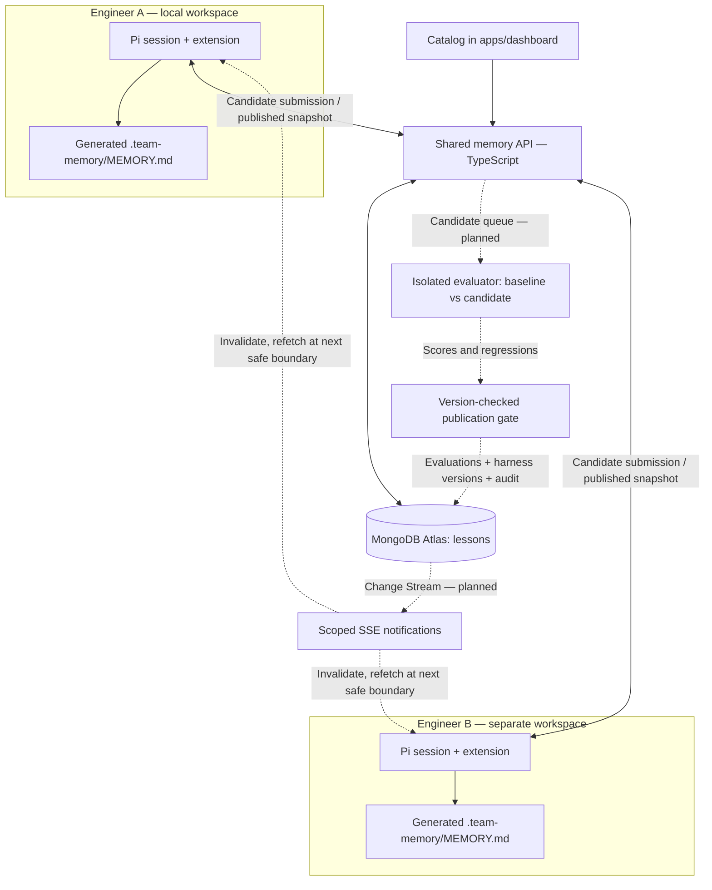
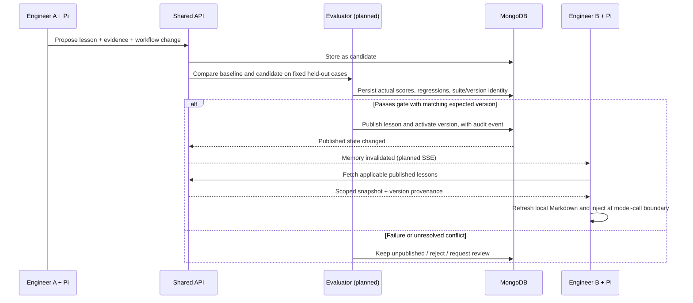

# Architecture

Target: independent engineering agents share useful, tested lessons while retaining separate
task histories and working copies. MongoDB owns shared records; Pi extensions adapt each local
agent's context. Native tickets in the Catalog provide the first ticket workflow.

## System sketch

Solid connections are scaffold paths. Dashed connections are planned. The MongoDB adapter is
implemented but requires a real URI; the default local demo runs against an in-memory repository.

## Learning and publication

## Ownership and contracts

| Boundary | Responsibility |
| --- | --- |
| Pi extension | Fetch current memory, generate local cache, propose lessons; later extract evidence and apply evaluated configuration |
| API | Enforce scope, validate requests, persist candidates; later authenticate users and coordinate publication |
| Evaluator | Execute fixed baseline/candidate trials in isolation; compute hard metrics; cannot be edited by the candidate |
| MongoDB | Durable shared knowledge, evidence metadata, versions, later vectors and publication history |
| Dashboard | Explain which lesson exists, where it came from, how it was tested, and who consumed it |

The model continues to run through Pi and its configured provider. Sharing changes retrieved
context and eventually harness configuration, not model weights. The implementation currently
injects lesson text only; `proposedChange` is saved but not activated.

## Ticket and agent-event integration

The existing dashboard remains the frontend. Native tickets are implemented in
`apps/api/src/tickets.ts` with validated records in `packages/contracts/src/tickets.ts`.
The `Ticket` export aliases that record, and the integration module re-exports the existing
repository interface. Incoming `AgentChange` types describe possible future ingestion;
they do not add routes, runtime validation or storage. See [frontend integration](frontend-integration.md)
for the differences from the implemented activity API. Recording an observation must not
automatically edit a ticket or publish a lesson.

## Memory and consistency

- Each lesson has a stable ID, team/project scope, version, applicability, evidence, and status.
- Only `published` records appear in the memory snapshot. Candidates remain visible in the dashboard.
- The generated file lives at `.team-memory/MEMORY.md`; existing root-level memory files are untouched.
- `/team-memory` and the next new agent run fetch the current snapshot. There is no automatic
  cross-machine push yet, and a file update cannot change a model request that is already running.
- Planned delivery is eventual consistency with published version IDs, reconnect recovery, and
  explicit client consumption logs. The backend is the source of truth after disconnection.
- Planned conflict resolution uses separate revisions and expected-version updates. An LLM
  summary must not silently overwrite another engineer's finding.

## Validation and evidence

Use the same model, fixtures, and budgets for baseline and candidate trials. Keep evaluation
answers and scoring outside the tested agent's workspace/context. Start with component accuracy,
required-check coverage, and regressions. A negative-control case must stop an overly broad lesson
from sending every duplicate UI bug to the event team. A single good result is a demo, not proof
of general reliability; grow the suite and repeat trials before wider rollout.

`apps/evaluator` scores a candidate against `evals/triage-suite.json` with no model call.
Component names come from `appliesTo`. A single component applies only when the ticket text
signals that component. A broad token, or more than one component, applies the lesson to every
suite ticket. Required checks are matched from the lesson text and proposed change. Expected
answers stay in the suite file and are not returned by `/v1/memory`.

The API persists the score, then publishes or rejects in one repository operation when
`expectedVersion` still matches. `needs-review` leaves the candidate unpublished. Pi records
the engineer id on memory fetch; the audit event lists the lesson versions in that snapshot.
Published lesson text is what Pi injects. `proposedChange` is scored here and is not installed
into the agent. There is no live model trial and no separate evaluator credential yet.

## Remote use and access

The starter binds both services to loopback and uses a development token for a single scope.
Before remote use, authenticate engineers, derive membership/scope on the server, separate worker
publication authority from agent submission authority, and use HTTPS. Tenant filters supplement
authorization; they are not a replacement. Keep retrieved lesson content separate from executable
tool authorization. Treat evidence references as claims until the evaluator verifies them.

## First implementation milestone

Two independently identified Pi sessions, one repo, one candidate learned from ticket A, fixed
positive/negative evaluation cases, one published version, and an improved result on ticket B.
The fixed-suite candidate-to-published transition is implemented. Live model trials, harness
activation, per-user auth, and cross-machine delivery remain open.
