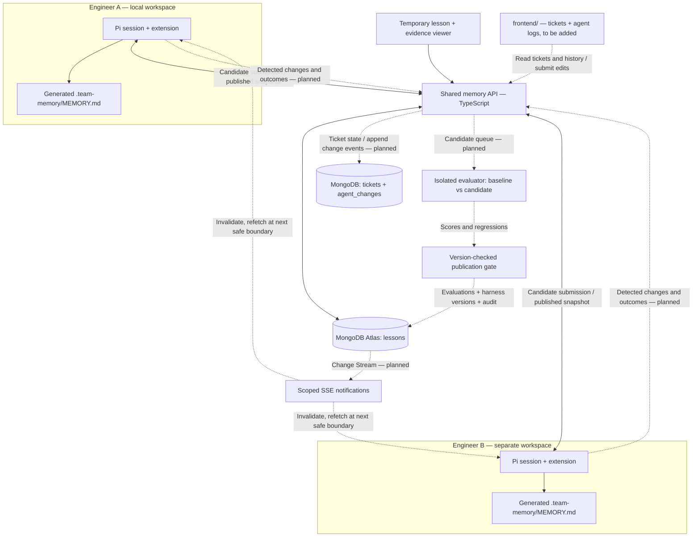
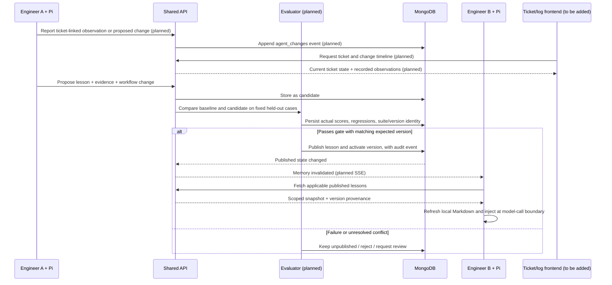

# Architecture

Target: independent engineering agents share useful, tested lessons while retaining separate
task histories and working copies. MongoDB owns shared records; Pi extensions adapt each local
agent's context. The team's own ticket and agent-log frontend will be added later at root `frontend/`.
Agent-detected changes are sent through the API to MongoDB and surfaced in that dashboard.

## System sketch

Solid connections are scaffold paths. Dashed connections are planned. The MongoDB adapter is
implemented but requires a real URI; the default local demo runs against an in-memory repository.

## Learning and publication

## Ownership and contracts

| Boundary | Responsibility |
| --- | --- |
| Pi extension | Fetch memory and propose lessons; later report ticket-linked changes, extract evidence, and apply evaluated configuration |
| API | Enforce scope and persist candidates; later serve native tickets, append change logs, and coordinate publication |
| Evaluator | Execute fixed baseline/candidate trials in isolation; compute hard metrics; cannot be edited by the candidate |
| MongoDB | Durable lessons now; planned ticket records, agent change logs, vectors, evaluations, and version history |
| `frontend/` (to be added) | Own ticket views, agent change timelines, engineer feedback, and shared-learning visibility |
| `apps/dashboard` | Temporary lesson/evidence viewer while the team's UI is being integrated |

Ticket and agent-log types are shared in `packages/contracts`; API repository contracts are in
`apps/api/src/integrations/tickets.ts` and `agent-changes.ts`. See
[frontend integration](frontend-integration.md) for proposed routes and an event example.

## Ticket and log flow — planned

The incoming frontend and Pi use the same scoped API. MongoDB holds current tickets in `tickets`
and a history of detected changes in `agent_changes`. Each event links to its ticket, agent/session,
engineer, timestamp, and evidence. The frontend reads that history from the API. Changes reported
by agents are observations or proposals until an action and its outcome are recorded; they do not
automatically mutate tickets or become published lessons. Useful patterns enter the existing
candidate/evaluation/publication loop. Raw log ingestion and its database storage are not yet built.

The model continues to run through Pi and its configured provider. Sharing changes retrieved
context and eventually harness configuration, not model weights. The implementation currently
injects lesson text only; `proposedChange` is saved but not activated.

## Memory and consistency

- Each lesson has a stable ID, team/project scope, version, applicability, evidence, and status.
- Only `published` records appear in the memory snapshot. Candidates remain visible in the dashboard.
- The generated file lives at `.team-memory/MEMORY.md`; existing root-level memory files are untouched.
- `/team-memory` and the next new agent run fetch the current snapshot. There is no automatic
  cross-machine push yet, and a file update cannot change a model request that is already running.
- Planned delivery is eventual consistency with published version IDs, reconnect recovery, and
  explicit client consumption logs. The backend is the source of truth after disconnection.
- Planned conflict resolution uses separate revisions and expected-version updates. An LLM
  summary must not silently overwrite another engineer's finding.

## Validation and evidence

Use the same model, fixtures, and budgets for baseline and candidate trials. Keep evaluation
answers and scoring outside the tested agent's workspace/context. Start with component accuracy,
required-check coverage, and regressions. A negative-control case must stop an overly broad lesson
from sending every duplicate UI bug to the event team. A single good result is a demo, not proof
of general reliability; grow the suite and repeat trials before wider rollout.

The repository contains fixed synthetic fixtures and an evaluator interface only. It does not
have computed scores, automatic publication, trained models, or a completed isolation mechanism.

## Remote use and access

The starter binds both services to loopback and uses a development token for a single scope.
Before remote use, authenticate engineers, derive membership/scope on the server, separate worker
publication authority from agent submission authority, and use HTTPS. Tenant filters supplement
authorization; they are not a replacement. Keep retrieved lesson content separate from executable
tool authorization. Treat evidence references as claims until the evaluator verifies them.

## First implementation milestone

Two independently identified Pi sessions, tickets and change timelines in the team's frontend,
one candidate learned from ticket A, fixed positive/negative evaluation cases, one published version,
and an improved result on ticket B. Ticket/log ingestion and candidate-to-published promotion are
the central missing pieces of the skeleton.
