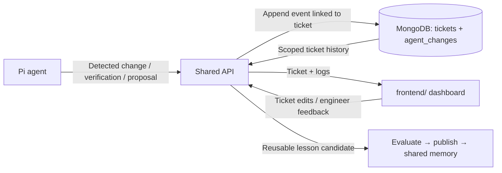

# Frontend integration contract

The team's existing UI will be added later at root `frontend/`. It will display tickets and a
ticket-linked history of changes agents recognize and report to MongoDB through the API.
The current `apps/dashboard` is a temporary lesson viewer; it is not the incoming ticket UI.
No frontend framework, dependencies, or workspace scripts have been chosen for the incoming app.

## Planned flow



Agents report events even when they do not produce a reusable lesson. The frontend shows the
source agent, engineer, ticket, timestamp, evidence, and any before/after values. Observations,
proposals, and confirmed outcomes must be labeled distinctly. Persisting a log entry does not
automatically edit a ticket or publish a lesson.

## Proposed routes — not implemented

| Method | Route | Intended behavior |
| --- | --- | --- |
| GET | `/v1/tickets` | List tickets within the authenticated team/project |
| GET | `/v1/tickets/:key` | Read a ticket and its current state |
| POST | `/v1/tickets` | Create a ticket from the frontend |
| PATCH | `/v1/tickets/:key` | Apply an explicit ticket edit with a corresponding history entry |
| POST | `/v1/agent-changes` | Append an agent-observed event; deduplicate retries by event ID |
| GET | `/v1/agent-changes?ticketKey=DEMO-101` | Read the scoped ticket timeline |

The existing `/v1/lessons` and `/v1/memory` endpoints continue to serve the shared-memory flow.
Only those lesson/memory endpoints are currently implemented. The table above is a handoff for
the upcoming frontend/backend integration, not a list of callable routes.

## Suggested agent event

```json
{
  "eventId": "event-engineer-a-session-001-007",
  "ticketKey": "DEMO-101",
  "agentId": "pi-engineer-a",
  "sessionId": "session-001",
  "kind": "triage-proposal",
  "summary": "Repeated event delivery points to the consumer rather than UI rendering.",
  "observedAt": "2026-09-26T14:00:00.000Z",
  "before": { "component": "frontend" },
  "after": { "component": "event-platform" },
  "evidence": [
    { "kind": "test", "reference": "event-replay", "summary": "Example only: attach actual test output during implementation." }
  ]
}
```

`AgentChangeInput` and the stored `AgentChange` are defined in `packages/contracts/src/index.ts`.
The API must derive the team/project and engineer identity from authentication, validate that
the referenced ticket belongs to the same scope, and add a server ID and receipt timestamp.
Use a unique `(teamId, projectId, eventId)` index to avoid duplicate logs when agents retry.
Add an index on `(teamId, projectId, ticketKey, recordedAt)` for the timeline. These indexes and
runtime request validation are still to implement.

## MongoDB ownership

- `tickets`: the current ticket state shared by the frontend and agents.
- `agent_changes`: append-only observations, proposed changes, verification results, and links to lessons.
- `lessons`: reusable knowledge with candidate/published state and evidence.
- `audit_events`: service-generated publication/rollback/consumption history; separate from agent observations.

The browser never needs a MongoDB connection string. The API mediates all reads and writes.
The proposed first UI integration can use refresh/polling; scoped push notifications can follow.
Unrelated private conversation history and arbitrary file changes are not implicitly uploaded.
